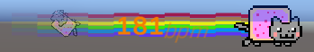
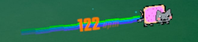
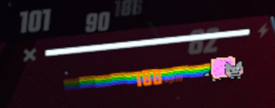

# Nya Skin for Heart Beat Quest

You nyan love this skin!

# Nyanview
Unity preview:  


Game Preview:  
  
  

more rainbows = higher heart rate

# Nyansage

Select the `nyancat` UI in the game mod config. Will avaliable soon.

# DIYnyan

Open the project with `Unity 2021.3.16f1` and edit the `cat` prefab.

Select `Assets > BuildAssetBundles` in unity.

```sh
cd Assets/AssetBundlesAndroid
adb push defaultwidget /sdcard/ModData/com.beatgames.beatsaber/Mods/HeartBeatQuest/UI/nyancat.bundle
```

You don't need restart the game, just restart the level to preview.

